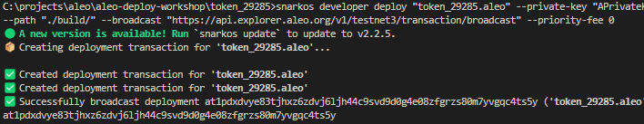

# Aleo Deployment Demo

Aleo Network에 Leo프로그램을 배포하는 예제를 살펴보겠습니다.

## 설치

아래 설치리스트를 확인하세요.

1.  [Install Git](https://git-scm.com/downloads)
2.  [Install Rust](https://www.rust-lang.org/tools/install)
3.  [Install Leo](https://developer.aleo.org/leo/installation)
4.  [Install snarkos](https://developer.aleo.org/testnet/getting_started/installation/)

	windows일 경우 [snasrkOS releases](https://github.com/AleoHQ/snarkOS/releases) 에 최신버전에 해당되는 windows zip파일을 다운받고, 시스템 환경변수의 PATH에 추가합니다.
5.  [Install Leo Wallet](https://leo.app/)
6.  [Install VSCode](https://code.visualstudio.com/download)

## Leo Wallet 생성

1. CLI 를 통한 지갑 생성

	  `leo account new`

	생성 후 주소, 보기 키, 개인 키(Address, View and Private Keys)를 보관해두세요.

2. 크롬 확장프로그램 Leo Wallet을 통한 지갑 생성
	- 계정에서 새 지갑을 생성할 수 있습니다.
	- `leo account new`  로 생성 후 확인된 개인 키(Private Key)를 import하여 계정을 추가할 수 있습니다.

3. `leo new <NAME>`을 통한 새 프로젝트를 생성시 .env에서 확인되는 PrivateKey를 import하여 지갑주소를 확인 하는 방법도 있습니다.


## Aleo Testnet 토큰 받기

[greenlist](https://faucetgreenlist.snarkos.net/) 접속하여 생성한 계정의 지갑주소를 입력하세요.

[Aleo Discord](https://discord.com/invite/aleohq)의 #faucet 채널에서 faucet을 신청합니다.

`/sendcredits {WalletAddress} 15`


# 예제 따라하기
## 1. 프로젝트 생성

Leo의 프로그램ID는 고유값을 사용합니다. 프로그램ID를 만들 때 주의해주세요.

#### macOS 및 Unix 기반 시스템

`leo new token_$RANDOM`

#### Windows

`leo new token_%RANDOM%`

위 명령어를 실행하면 아래와 같은 구조의 폴더가 생성됩니다.

```
.
├── build
│   ├── main.aleo
│   └── program.json
├── inputs
│   └── ${token_$RANDOM}.in
├── program.json
├── src
│   └── main.leo
├── .env
├── program.json
└── README.md
```

## 2. 프로그램 작성

`.env` 파일의 PRIVATE_KEY 값에 생성한 지갑주소의 PrivateKey를 입력합니다.
```
NETWORK=testnet3
PRIVATE_KEY={privateKey}
```


`src/main.leo` 파일에 코드를 작성합니다. 본 예제에서는 기본 토큰을 구현합니다.

```
program <program_name>.aleo {
    // Define a token struct with an owner and balance
    record Token {
        owner: address,
        balance: u32,
    }

    // Define a mint transition that takes a balance and returns a token
    transition mint(balance: u32) -> Token {
        return Token {
            owner: self.caller,
            balance: balance,
        };
    }

    // Define a transfer transition that takes a receiver, amount and token and returns two tokens
    transition transfer(receiver: address, amount: u32, input: Token) -> (Token, Token) {
        let sender_balance: u32 = input.balance - amount;
        let recipient: Token = Token {
            owner: receiver,
            balance: amount,
        };

        let sender: Token  = Token {
            owner: self.caller,
            balance: sender_balance
        };

        return (recipient, sender);
    }
}
```

## 3. Inputs값 정의 | 4. 프로그램 Build & Test

해당 예제에서는 아래 두 trasition 함수를 실행시켜봅니다.
```
leo run mint
leo run transfer
```

### 1. leo run mint

`./inputs/${program_name}.in` 파일에서 `mint`함수의 입력값을 정의합니다. 
아래 입력값을 참고하세요:

```
// The program input for deploy_workshop/src/main.leo
[mint]
balance: u32 = 100u32;
```

`leo run mint`를 실행시키면 아래와 같은 결과값을 확인하실 수 있습니다.

```
Leo ✅ Compiled 'main.leo' into Aleo instructions

⛓  Constraints

 •  'token_{RANDOM}.aleo/mint' - 2,020 constraints (called 1 time)

➡️  Output

 • {
  owner: aleo1t0ed7wqz4mesu28hswxrh4vaeve2avc5frt9zxm8juqsekz0aupsrvxl2e.private,
  balance: 100u32.private,
  _nonce: 5983677101209587487132934641741307435133784922793074523358967829833303799284group.public
}

       Leo ✅ Finished 'token_{RANDOM}.aleo/mint'
```

`Output`으로 얻은 출력값은 복사하여 `./inputs/${program_name}.in` 파일에 사용됩니다.

### 2. leo run transfer

`./inputs/${program_name}.in` 파일 `trasfer`함수의 입력값을 정의합니다.

항목을 추가하고 `input`값에 위에서 복사한 Output값을 넣습니다.

해당 값에서 `.private`, `.public` 접미사는 삭제해야 합니다.

아래 입력값을 참고하세요:

```
[mint]
balance: u32 = 100u32;

[transfer]
receiver: address = aleo19dvdccgf3jsce20e0yqfvtunupm4ms2d8al8ztxkqss5cywqjvqq4ldewd;
amount: u32 = 10u32;
input: Token = Token {
  owner: aleo1t0ed7wqz4mesu28hswxrh4vaeve2avc5frt9zxm8juqsekz0aupsrvxl2e,
  balance: 100u32,
  _nonce: 5983677101209587487132934641741307435133784922793074523358967829833303799284group
};
```

`leo run mint`를 실행시키면 아래와 같은 결과값을 확인하실 수 있습니다.

```
Leo ✅ Compiled 'main.leo' into Aleo instructions

⛓  Constraints

 •  'token_{RANDOM}.aleo/transfer' - 4,075 constraints (called 1 time)

➡️  Outputs

 • {
  owner: aleo1t0ed7wqz4mesu28hswxrh4vaeve2avc5frt9zxm8juqsekz0aupsrvxl2e.private,
  balance: 90u32.private,
  _nonce: 5161595790032802700909299159209292384038310713576674831963017218397813786950group.public
}
 • {
  owner: aleo1yn6halw6astkc8jsl88sukelef3e8xrawugfjtx7kjcuuxdm6spsdtc249.private,
  balance: 10u32.private,
  _nonce: 127132679900453090880796914979639793562053439260438989071288234460014641030group.public
}

       Leo ✅ Finished 'token_{RANDOM}.aleo/transfer'
```


## 배포 스크립트


프로젝트 경로에 `deploy.sh` 파일을 생성합니다.

아래 내용을 참고하세요:

```
PRIVATEKEY="${PRIVATEKEY}"
APPNAME="<project_name>"

cd .. && snarkos developer deploy "${APPNAME}.aleo" --private-key "${PRIVATEKEY}" --query "https://api.explorer.aleo.org/v1" --path "./${APPNAME}/build/" --broadcast "https://api.explorer.aleo.org/v1/testnet3/transaction/broadcast" --priority-fee 0

```

PRIVATEKEY는 .env에 사용했던 키 값을 사용합니다. 해당 예제에서 project_name은 token_{RANDOM}값이 될 것 입니다.

작성한 deply 스크립트를 실행시킵니다.

window유저인 경우 설치과정에서 시스템 환경변수를 설정하였다면 아래에 해당되는 부분를 커맨드창에 실행시켜 배포 진행을 할 수 있습니다.
```
snarkos developer deploy "${APPNAME}.aleo" --private-key "${PRIVATEKEY}" --query "https://api.explorer.aleo.org/v1" --path "./${APPNAME}/build/" --broadcast "https://api.explorer.aleo.org/v1/testnet3/transaction/broadcast" --priority-fee 0
``` 

실행 후 결과 화면



